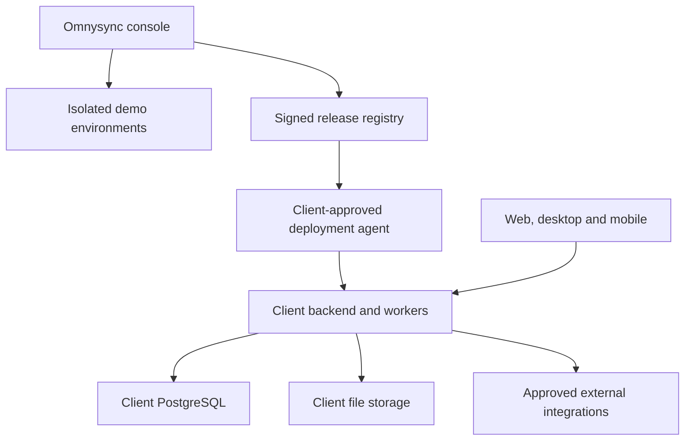

# Platform architecture
Version 0.1 • Proposed baseline

## Deployment topology
Default production deployment is an independent client installation: client-controlled infrastructure, database, object storage, identity configuration, secrets, domain and backups. One installation can host several legal entities and branches. A production client is not required to connect to Omnysync's control plane to transact.

Omnysync's control plane manages demo environments, reusable templates, build metadata, optional fleet health and release distribution. It stores no client financial/HR data by default. Optional management uses an outbound deployment agent with client-approved scopes and revocable credentials. The control plane must never become an implicit super-admin login.



## Runtime and stack
| Layer | Proposed default | Reason / boundary |
| --- | --- | --- |
| Workspace | TypeScript monorepo, pinned workspace tooling | Reuse contracts/UI without independent client forks |
| Web | React, TypeScript, semantic accessible components, query cache, form validation | Stable task patterns; server remains authoritative |
| Backend | TypeScript modular monolith; NestJS with Fastify candidate | Explicit domain boundaries and a small operating footprint |
| Database | Supported stable PostgreSQL, starting evaluation with 18 | Exact numeric and transactional core; select supported versions at implementation |
| Data access | Typed query layer; reviewed SQL migrations and critical posting SQL | ORM must not conceal constraints, locks or isolation |
| Jobs | PostgreSQL-backed durable jobs and transactional outbox | Basic VPS avoids required distributed infrastructure |
| Durable orchestration | Adapter; evaluate Temporal when long-running complexity justifies it | Versioned workflows, not a launch requirement |
| Files | S3-compatible store or supported local-volume adapter | Client-owned documents with portable exports |
| Cache | Optional Redis adapter | Never authoritative for balances, approvals or inventory |
| Reporting | PostgreSQL read models first; separate analytical store when measured need arises | Traceable freshness and less operational complexity |
| Desktop | Evaluate Tauri wrapper; Electron fallback by device/printer needs | Same web/API contract; native bridges tightly allowlisted |
| Mobile | React Native candidate, shared tokens/contracts; role-focused apps | Scanning, field work, approvals and self-service |
| Identity | OIDC/SAML adapter; client-hosted identity option | SSO and no dependency on Omnysync credentials |
| Observability | Structured redacted logs, metrics, traces | Trace commands, job failures and reconciliation drift |

These are architectural selections subject to short implementation ADRs. Do not silently adopt beta releases. Confirm licenses, maintainer health, integration needs and patch policies before locking versions. A minimal deployment MUST remain supportable without Kubernetes.

## Why a modular monolith first
Financial posting, allocations and inventory valuation benefit from one ACID boundary. Launch microservices would multiply failure modes and make small VPS deployments expensive. Enforce contracts internally so connectors, analytics or compute-heavy planning can be extracted later. No module may directly mutate another module's tables. Cross-domain commands within the monolith may share a unit of work through an application orchestrator. External side effects always follow committed intent.

## Dependency rules
Platform is always present. Financially active modules require finance core and selected tax/currency policies. Operational-only inventory mode is explicitly supported but cannot present valuation as financial truth. A module lists hard dependencies, optional adapters, owned tables, commands, emitted events, reports, permissions, settings, migrations, seed packs and localization requirements. UI visibility, availability, permission and readiness are separate dimensions.

## Repository target
```text
apps/
  web/                   # client ERP shell
  control-console/       # Omnysync control plane
  api/                   # client modular monolith
  worker/                # client jobs/outbox runners
  desktop/               # native wrapper
  mobile/                # focused native experiences
packages/
  platform/              # auth, org, audit, files, configuration
  contracts/             # commands, events, API schemas
  financial-engine/      # posting, periods, mappings, money
  ui/                    # tokens and accessible primitives
  modules/<module>/      # domain, application, ports, adapters, tests
  localization/<country>/
  industry-packs/<pack>/
  integrations/<provider>/
  testing/               # deterministic fixtures and harnesses
infra/
  compose/ migrations/ backups/ observability/
docs/
  specifications/ decisions/ runbooks/
```
Illustrative target, not a scaffold delivered by this specification.

## Organization and tenancy
installation_id identifies a deployment; organization_id scopes client business data; legal_entity_id identifies the accounting/legal company; branch_id and warehouse_id narrow operations. Never treat legal entity as a replacement for organization isolation. A demo installation may contain one isolated organization; pooled demos are a separate supported profile only after tenant-boundary tests.

All business rows, object paths, job payloads, cache keys and search documents carry organization scope. Financial facts include legal entity and book. Composite keys/FKs prevent cross-organization references. Dedicated deployments still require least-privilege organization/entity controls. PostgreSQL RLS provides defense in depth with non-owner runtime roles; sensitive field authorization also lives in the application. See SECURITY.md.

## Transactions and consistency
A business command validates identity, capabilities, permissions, revision and state; obtains the required locks; persists the document, stock movements, journals, audit and outbox atomically. A source may have several purpose-specific journals (invoice, fulfillment, FX, settlement, recognition), uniquely keyed by organization/entity/book/source/purpose/version. Internal accounting is not eventual. External delivery is at-least-once, with inbox deduplication and provider-specific idempotency.

Read models and notifications may lag; financial screens show an as-of watermark and support an authoritative view. No distributed transaction is assumed with banks, tax gateways or shipping APIs. Reconcile unknown outcomes before retrying financial side effects.

## Scaling and failure boundaries
Separate web/API/worker processes with limits; isolate expensive exports/planning. Add indexes and pagination before replicas; add workers before services. Dedicated client topology prevents one client's import from affecting another installation. In pooled demos, enforce tenant quotas. Replicas never serve read-after-post checks or permission revocation until the consistency strategy permits it.

Client network loss interrupts connected commands; local drafts are allowed only under the offline matrix. Central-console failure does not interrupt client transactions. A failed worker does not lose committed jobs. A broken connector cannot take down core posting.

## Upgrades
Signed immutable releases; schema and extension compatibility matrix; backup and staging rehearsal; expand/migrate/contract migration sequence; feature flags separate from migration execution. Old client versions coexist during supported rollout windows. Client-owned deployments may pin supported releases. No remote schema modification without their authorized management policy.

